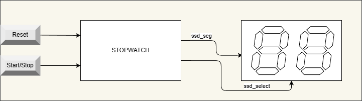
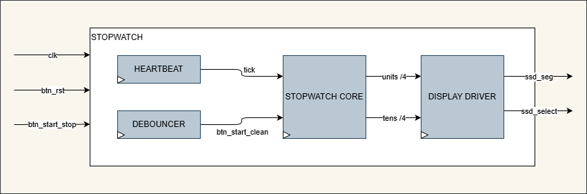
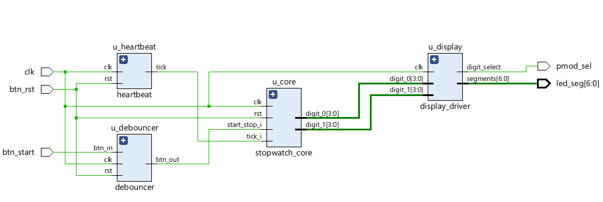
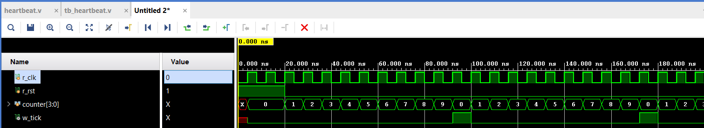
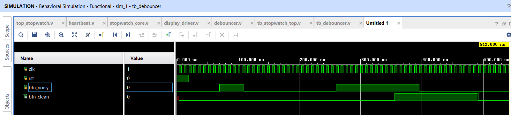
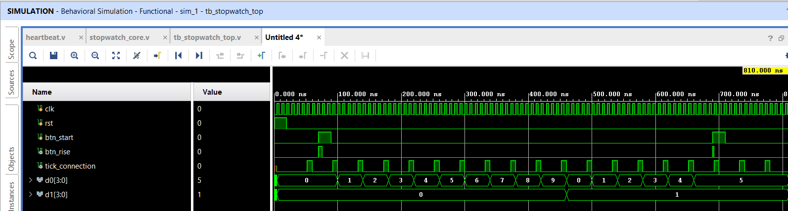
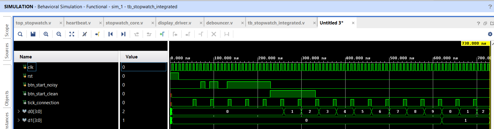

# FPGA Stopwatch Controller




## Overview
This project implements a precise digital stopwatch on the Arty Z7-20 FPGA development board. The design features a modular architecture written in Verilog, handling asynchronous user inputs and multiplexed 7-segment display control.





## Hardware Specification
* **FPGA Board:** Digilent Arty Z7-20 (Zynq-7000 AP SoC)
* **Display:** Digilent Pmod SSD (Two-digit Seven-segment Display) connected to Port JB.
* **Inputs:** On-board mechanical buttons (BTN0 for Reset, BTN1 for Start/Stop).


## Architecture Details
The design is split into four synchronous modules:

1.  **Debouncer:** Filters mechanical bounce from the push-buttons using a counter-based hysteresis (20ms threshold).
2.  **Heartbeat:** A parametric clock divider generating a 100Hz enable pulse (10ms resolution) from the 125MHz system clock.
3.  **Core Logic:** Contains the Finite State Machine (FSM) for counting states and Binary Coded Decimal (BCD) counters for unit/tens tracking.
4.  **Display Driver:** Performs 7-segment decoding and time-multiplexing to drive the Pmod SSD.


## Verification
All modules were verified using behavioral simulation in Vivado. The verification strategy involved both unit testing (isolated modules) and integration testing (full signal chain).

### 1. Heartbeat Generation
The timing accuracy was verified by simulating the rollover of the clock divider.


### 2. Debouncer Filter (Unit Test)
The input filter was validated by injecting synthetic noise (glitches) into the signal. The simulation confirms that:
* **Noise Rejection:** Pulses shorter than the defined threshold are ignored.
* **Signal Validation:** Only stable signals (held longer than the threshold) trigger the output.
*(Note: Parameter `CNT_MAX` was reduced to 10 cycles for simulation visibility).*
 

### 3. Core Logic & Integration
The stopwatch logic was verified in two stages:

* **Stage A: Core Unit Testing (Ideal Inputs)**
    Verified the BCD counting logic and FSM transitions (IDLE <-> RUN) using clean, ideal input signals.
    

* **Stage B: Full Integration Testing (Noisy Inputs)**
    Verified the complete signal chain (`Button` -> `Debouncer` -> `Core`). A noisy signal with bouncing was injected to confirm that the Core FSM only triggers once per physical button press, proving the robustness of the system.
    
    


## Pinout Mapping
### Pmod SSD (Connected to Port JB)
The 7-segment display must be plugged into the **JB** header (bottom row aligned, ensuring VCC/GND match).

| Pmod Signal   | Arty Port (JB) | FPGA Pin | Description         |
| :---          | :---           | :---     | :---                |
| **AA**        | JB[1]          | W14      | Segment A           |
| **AB**        | JB[2]          | Y14      | Segment B           |
| **AC**        | JB[3]          | T11      | Segment C           |
| **AD**        | JB[4]          | T10      | Segment D           |
| **AE**        | JB[7]          | V16      | Segment E           |
| **AF**        | JB[8]          | W16      | Segment F           |
| **AG**        | JB[9]          | V12      | Segment G           |
| **C**         | JB[10]         | W13      | Digit Select (CAT)  |

### System Controls
| Function      | Label on Board | FPGA Pin | Description         |
| :---          | :---           | :---     | :---                |
| **Clock**     | CLK            | H16      | 125 MHz Oscillator  |
| **Reset**     | BTN0           | D19      | Active High Reset   |
| **Start**     | BTN1           | D20      | Start/Stop Trigger  |


## Project Structure
The repository is organized as follows:

```text
fpga_stopwatch/
├── docs/               # Documentation assets (diagrams, waveforms)
├── src/
│   ├── rtl/            # Synthesizable Verilog sources (heartbeat, debouncer, core...)
│   ├── tb/             # Testbench files
│   └── constrs/        # Xilinx Design Constraints (.xdc)
└── README.md           # Project Documentation
```

## How to Run (Vivado)

1. **Create Project**: Open Vivado and create a new RTL project targeting the Arty Z7-20 board.

2. **Add Sources**: Import all files from `src/rtl` and `src/tb`.

3. **Add Constraints**: Import the `.xdc` file from `src/constrs`.

4. **Simulation**: 
    - Set `tb_stopwatch_integrated` as the top module for simulation.
    - Run Behavioral Simulation to verify the debouncing logic.

5. Implementation:
    - Click **Generate Bitstream**.
    - Open **Hardware Manager -> Auto Connect**.
    - Program the device.